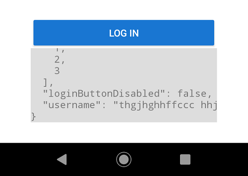

# rn-state-inspect

This is a simple react native component that renders a `ScrollView` containing any JS/JSON data strucutre provided to the component.

## Installing 

`npm i --save-dev rn-state-inspect`  
or  
`yarn add --dev rn-state-inspect`

## Usage

```jsx
import StateInspect from 'rn-state-inspect';

...

render() {
    return (
        <StateInspect state={this.state} />
    );
}
```

An example of the rendered component is:
